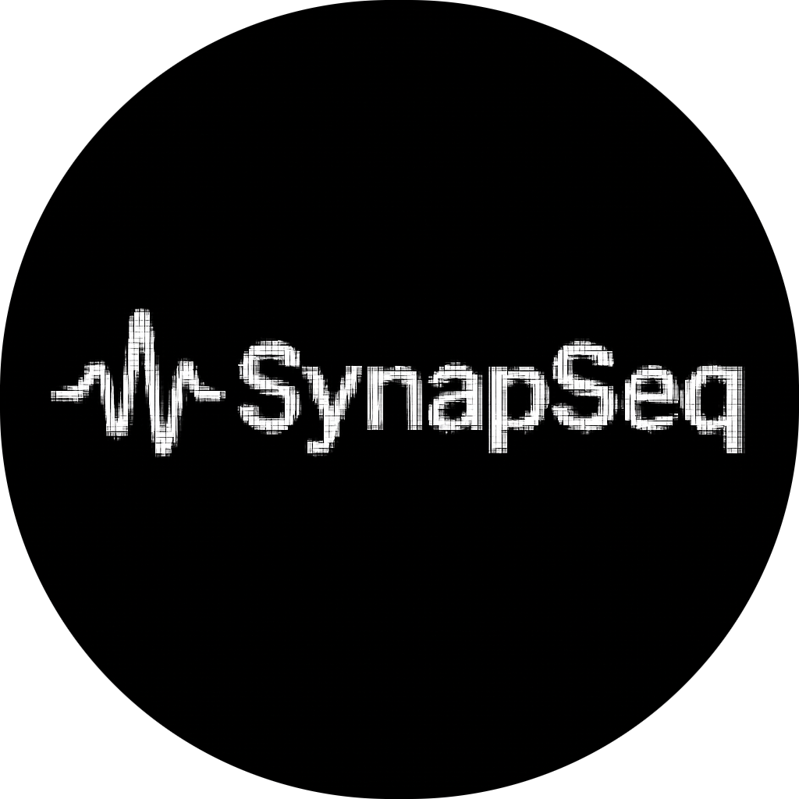

<p align="center">
  
</p>

<h1 align="center">SynapSeq</h1>

<p align="center">
  <a href="https://github.com/ruanklein/synapseq/releases/latest"></a>
  <a href="COPYING.txt"></a>
  <a href="go.mod"></a>
  <a href="https://github.com/ruanklein/synapseq/issues"></a>
  <a href="https://github.com/ruanklein/synapseq/discussions"></a>
  <a href="https://github.com/ruanklein/synapseq/commits"></a>
</p>

<p align="center"><strong>Synapse-Sequenced Brainwave Generator</strong></p>

SynapSeq is a lightweight and efficient engine for sequencing audio tones for brainwave entrainment, using a simple text-based format. It helps induce states such as relaxation, meditation, and focused awareness by guiding brainwave frequencies through sound.

## Table of Contents

- [Quick Start Example](#quick-start-example)
- [Installation](#installation)
- [Compilation](#compilation)
- [Documentation](#documentation)
- [Go Library](#go-library)
- [FAQ](#faq)
- [Contributing](#contributing)
  - [Code of Conduct](#code-of-conduct)
- [License](#license)
  - [Third-Party License](#third-party-licenses)
- [Contact](#contact)
- [Credits](#credits)

## Quick Start Example

Save the following content as `relax.spsq`:

```
# Presets
alpha
  noise brown amplitude 40
  tone 250 binaural 10.0 amplitude 10
theta
  noise brown amplitude 40
  tone 250 binaural 5.0 amplitude 10

# Timeline sequence
00:00:00 silence
00:00:15 alpha
00:02:00 alpha
00:03:00 theta
00:04:00 theta
00:05:00 alpha
00:06:00 alpha
00:07:00 theta
00:08:00 theta
00:09:00 alpha
00:10:00 silence
```

Run SynapSeq to generate the audio file:

```bash
synapseq relax.spsq relax.wav
```

The audio file will be created in the current directory.

### Phase Sequence

When processing this file, SynapSeq will execute the following sequence of phases:

```
Phases:
├─ 0:00-0:15: Fade-in from silence to alpha (start of sequence)
├─ 0:15-2:00: alpha (10Hz) - Brown noise + binaural tone
├─ 2:00-3:00: Transition: 10Hz → 5Hz (alpha → theta)
├─ 3:00-4:00: theta (5Hz) - Brown noise + binaural tone
├─ 4:00-5:00: Transition: 5Hz → 10Hz (theta → alpha)
├─ 5:00-6:00: alpha (10Hz)
├─ 6:00-7:00: Transition: 10Hz → 5Hz (alpha → theta)
├─ 7:00-8:00: theta (5Hz)
├─ 8:00-9:00: Transition: 5Hz → 10Hz (theta → alpha)
└─ 9:00-10:00: Fade-out from alpha to silence (end of sequence)
```

### More Examples

You can find additional example scripts in the `samples/` folder of this repository. See the [samples/README.md](samples/README.md) for detailed information about each example.

## Installation

You can download the latest precompiled binaries for Windows, macOS, or Linux from the [Releases](https://github.com/ruanklein/synapseq/releases/latest) page.

## Compilation

For users who prefer to compile from source, please follow the [Compilation](docs/COMPILE.md) instructions.

## Documentation

For detailed information on all features and advanced usage, see the [USAGE.md](docs/USAGE.md) file.

## Go Library

SynapSeq can also be used as a Go library in your own projects. See the [Go Library Documentation](https://pkg.go.dev/github.com/ruanklein/synapseq/v3/core) for instructions on how to integrate SynapSeq into your Go applications.

## FAQ

For answers to common questions about SynapSeq and brainwave entrainment, see the [FAQ](docs/FAQ.md).

## Contributing

We welcome contributions!

Please read the [CONTRIBUTING.md](CONTRIBUTING.md) file for guidelines on how to contribute code, bug fixes, documentation, or new sequence files to the project.

### Code of Conduct

Please note that all contributors are expected to follow our [Code of Conduct](CODE_OF_CONDUCT.md).

- Be respectful and considerate in all interactions.
- Harassment or abusive behavior will not be tolerated.
- Help us maintain a friendly and inclusive community.

If you experience or witness unacceptable behavior, please report it as described in the [Code of Conduct](CODE_OF_CONDUCT.md).

## License

SynapSeq is distributed under the GPL v2 license. See the [COPYING.txt](COPYING.txt) file for details.

### Third-Party Licenses

SynapSeq makes use of third-party libraries, which remain under their own licenses.  
All original code in SynapSeq is licensed under the GNU GPL v2, but the following components are included and redistributed under their respective terms:

- **[beep](https://github.com/gopxl/beep)**  
  License: MIT  
  Used for audio encoding/decoding.

- **[go-yaml](https://github.com/goccy/go-yaml)**  
  License: MIT  
  Used for YAML parsing and processing.

- **[pkg/errors](https://github.com/pkg/errors)**  
  License: BSD 2-Clause  
  Used indirectly via `beep` for error wrapping and stack trace utilities.

- **[google/uuid](https://github.com/google/uuid)**  
  License: BSD 3-Clause  
  Copyright © 2009-2014 Google Inc.  
  Used for UUID generation and unique identifier handling.

All third-party copyright notices and licenses are preserved in this repository in compliance with their original terms.

## Contact

We'd love to hear from you! Here's how to get in touch:

### Issues (Bug Reports & Feature Requests)

Use [GitHub Issues](https://github.com/ruanklein/synapseq/issues) for:

- Bug reports and technical problems
- Feature requests and enhancement suggestions
- Documentation improvements

### Discussions (Questions & Community)

Use [GitHub Discussions](https://github.com/ruanklein/synapseq/discussions) for:

- General questions and support (e.g., "How do I use `@presetlist`?")
- Help with your sequences (e.g., "My sequence isn't working, can you help?")
- Sharing your own sequences and presets with the community
- Discussing ideas and best practices
- Showcasing creative use cases

### Quick Guidelines

- **Found a bug?** → Open an Issue
- **Want a new feature?** → Open an Issue
- **Need help or have questions?** → Start a Discussion
- **Want to share your sequences?** → Post in Discussions
- **General feedback or ideas?** → Start a Discussion
